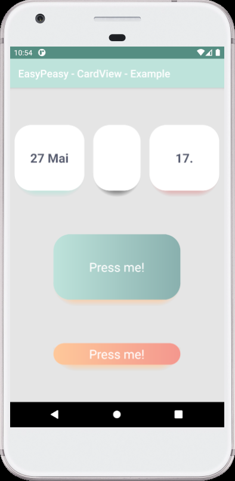

# Custom CardView



## Features

* Custom CardView shadow (colored shadow).
* Custom CardView background (one color or left-right gradient).

## Contribute

* Please give feedback an [issue](https://github.com/dmitriykhalturin/custom-card-view/issues) or [pull request](https://github.com/dmitriykhalturin/custom-card-view/pulls)

## Gradle

You need to make sure you have the JCenter repository included in the build.gradle file in the root of your project:
```groovy
repositories {
    jcenter()
}
```

Next add a dependency in the build.gradle file of your app module. The following will add a dependency to the library:

```groovy
dependencies {
    implementation "com.github.dmitriykhalturin:customcardview:${latestVersion}"
}
```

## Usage

```xml
<easy.peasy.cardview.widget.CardView
    android:layout_width="match_parent"
    android:layout_height="match_parent"
    app:cardShadowStartColor="#BFFEC89A"
    app:cardBackgroundEndColor="#89B0AE"
    app:cardBackgroundStartColor="#BEE3DB"
    app:cardCornerRadius="@dimen/cornerRadius"
    app:cardElevation="8dp">
</easy.peasy.cardview.widget.CardView>
```

All attributes see in [attrs.xml](./customcardview/src/main/res/values/attrs.xml).

This component is based on android CardView. But has some differences. The main difference affecting the layout is overlap corners.
